# *Lucrul individual*

**Realizat:** Crangaci Sabina <br>
**Grupa:** IA2201

## **Instructiuni de instalare si pornire**

Navigati in directorul proiectului si rulati urmatoarea comanda pentru a instala dependentele: <br>
```cd nume_proiect```<br>
```npm install```

Porneste serverul de dezvoltare pentru a putea vizualiza aplicatia in browser:<br>
```npm run dev```

Acceseaza aplicatia in browser: Dupa ce serverul este pornit, Vite iti va oferi un link:
- Local: http://localhost:5173/
- Network: use --host to expose

## **Descrierea proiectului**
**Titlul proiectului:** Aplicatie de organizare a vacantelor

**Scopul proiectului:** Acest proiect reprezinta o aplicatie web care permite utilizatorilor sa gestioneze si sa-si organizeze vacantele. Aplicatia ajuta utilizatorii sa pastreze o evidenta a destinatiilor de calatorie, datelor asociate si informatiilor relevante despre fiecare vacanta.

**Funcții principale:**
1. ***Interfata prietenoasa:*** Aplicatia dispune de un design simplu, dar atractiv, pentru a ușura utilizarea.
1. ***Vizualizare vacante:*** Lista vacantelor este afisata intr-o interfata intuitiva, alaturi de datele introduse si optiunea de sterge vacanta.

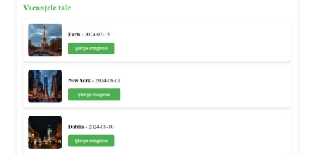

3. ***Adaugare vacanta:*** Utilizatorii pot introduce o noua destinatie de vacanta, incluzind numele orasului, data si un URL al unei imagini reprezentative.

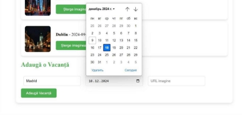

5. ***Stergere vacanta:*** Utilizatorii pot elimina o destinatie din lista lor cu un singur clic.

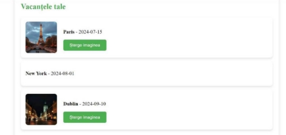

```VacationPage.vue```

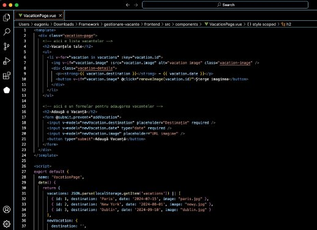

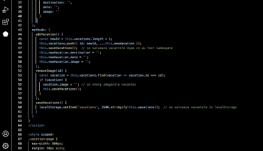

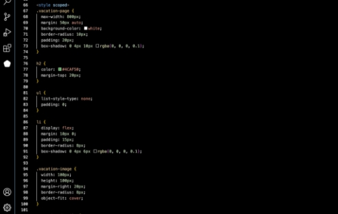

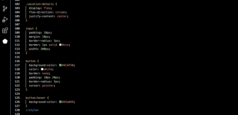

```create_vacations_table.php```

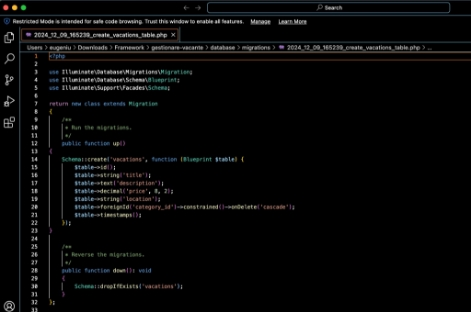

```api.php```

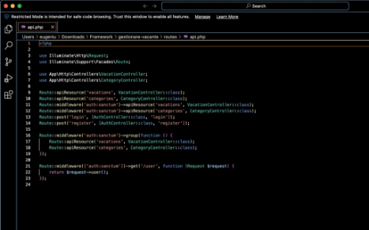

```VacationController.php```

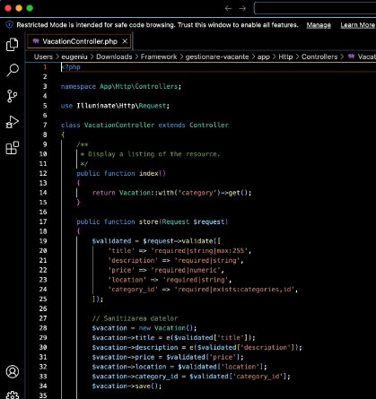

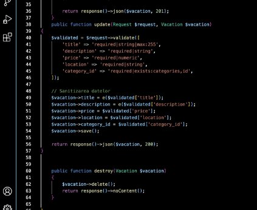

```AuthController.php```

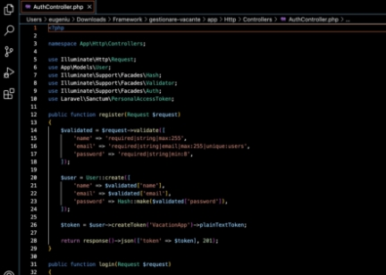

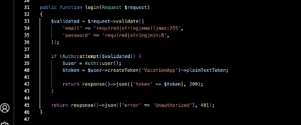

## **Alte aspecte**

Aplicatia protejeaza utilizatorii impotriva atacurilor, cum ar fi SQL Injection, CSRF si XSS, folosind functiile de securitate din Laravel. In plus, permite efectuarea de operatiuni CRUD pentru fiecare resursa principala, cum ar fi vacantele, prin intermediul controllerelor si modelelor Laravel. Aceste masuri fac aplicatia sigura si protejeaza datele utilizatorilor, dar si baza de date. De asemenea, aplicatia salveaza si gestioneaza datele utilizatorilor in localStorage pentru o utilizare mai rapida si eficienta.

## **Lista surselor utilizate**

Documentația oficiala Laravel- **https://laravel.com/docs** <br>
Vue.js Documentation- **https://vuejs.org/v2/guide/** <br>
LocalStorage Documentation- **https://developer.mozilla.org/en-US/docs/Web/API/Window/localStorage** <br>
Informatii legate de securitatea aplicatiilor web- **https://developer.mozilla.org** <br>

## **Concluzie:**

In cadrul lucrarii individuale, am realizat o aplicatie pentru gestionarea vacantelor folosind ```Laravel``` si ```Vue.js```. Aplicatia permite utilizatorilor sa se inregistreze, sa se autentifice si sa efectueze operatiuni de baza, cum ar fi adaugarea, actualizarea si stergerea vacantelor. Am implementat masuri de securitate pentru a proteja datele utilizatorilor si pentru a preveni atacurile comune. De asemenea, am creat o interfata usor de folosit care permitevizualizarea rapida a vacantelor. In general am facut o aplicatie functionala si sigura, care ofera o experienta buna utilizatorilor.


